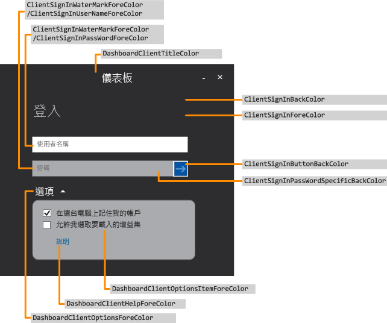
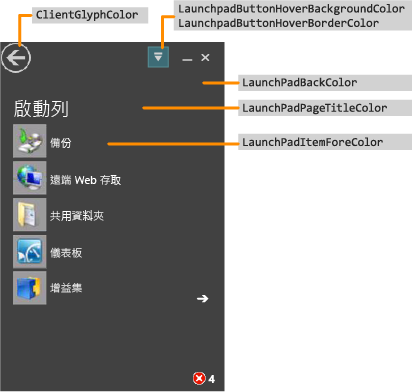
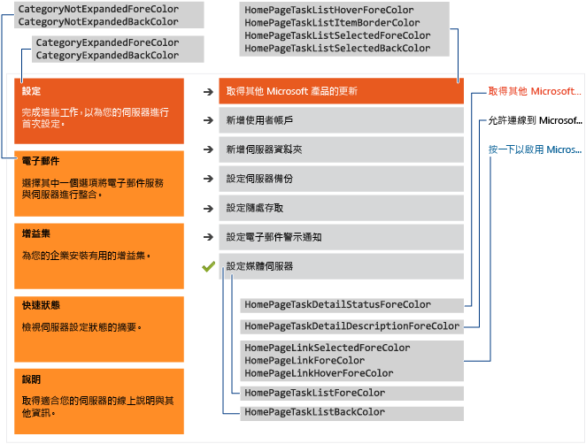

# <a name="change-the-color-scheme-of-the-dashboard-and-launchpad"></a>變更儀表板及啟動列的色彩配置

>適用于： Windows Server 2016 Essentials、Windows Server 2012 R2 Essentials、Windows Server 2012 Essentials

定義想要用於 XML 格式檔案的色彩、在伺服器的資料夾中安裝 .xml 檔案，並在登錄項目中指定 .xml 檔案名稱，就可以變更儀表板及啟動列的色彩配置。

## <a name="create-the-xml-file"></a>建立 XML 檔案
 下列範例顯示 .xml 檔案的可能內容：

```xml
<DashboardTheme xmlns="https://www.microsoft.com/HSBS/Dashboard/Branding/2010">

  <!-- Hex color values overwriting default SKU theme colors -->

    <SplashScreenBackgroundColor HexValue="FFFFFFFF"/>
    <SplashScreenBorderColor HexValue="FF000000"/>
    <MainHeaderBackgroundColor HexValue="FF414141"/>
    <MainTabBackgroundColor HexValue="FFFFFFFF"/>
    <MainTabFontColor HexValue="FF999999"/>
    <MainTabHoverFontColor HexValue="FF0072BC"/>
    <MainTabSelectedFontColor HexValue="FF0072BC"/>
    <MainButtonPressedBackgroundColor HexValue="FF0072BC"/>
    <MainButtonFontColor HexValue="FFFFFFFF"/>
    <MainButtonBorderColor HexValue="FF6E6E6E"/>
    <ScrollButtonBackgroundColor HexValue="FFF0F0F0"/>
    <ScrollButtonArrowColor HexValue="FF999999"/>
    <ScrollButtonHoverBackgroundColor HexValue="FF999999"/>
    <ScrollButtonHoverArrowColor HexValue="FF6E6E6E"/>
    <ScrollButtonSelectedBackgroundColor HexValue="FF6E6E6E"/>
    <ScrollButtonSelectedArrowColor HexValue="FFFFFFFF"/>
    <ScrollButtonDisabledBackgroundColor HexValue="FFF8F8F8"/>
    <ScrollButtonDisabledArrowColor HexValue="FFCCCCCC"/>
    <AlertTextBlockBackground HexValue="FFFFFFFF"/>
    <AlertTextBlockFont HexValue="FF000000"/>
    <FontColor HexValue="FF000000"/>
    <SubTabBarBackgroundColor HexValue="FFFFFFFF"/>
    <SubTabBackgroundColor HexValue="FFFFFFFF"/>
    <SubTabSelectedBackgroundColor HexValue="FF414141"/>
    <SubTabBorderColor HexValue="FF787878"/>
    <SubTabFontColor HexValue="FF787878"/>
    <SubTabHoverFontColor HexValue="FF0072BC"/>
    <SubTabPressedFontColor HexValue="FFFFFFFF"/>
    <ListViewColor HexValue="FFFFFFFF"/>
    <PageBorderColor HexValue="FF999999"/>   
    <LaunchpadButtonHoverBorderColor HexValue="FF6BA0B4"/>
    <LaunchpadButtonHoverBackgroundColor HexValue="FF41788F"/>
    <ClientArrowColor HexValue="FFFFFFFF"/>
    <ClientGlyphColor HexValue="FFFFFFFF"/>
    <SplitterColor HexValue="FF83C6E2"/>
    <HomePageBackColor     HexValue="FFFFFFFF"/>
    <CategoryNotExpandedBackColor HexValue="FFFFB343"/>
    <CategoryExpandedBackColor HexValue="FFF26522"/>
    <CategoryNotExpandedForeColor HexValue="FF2A2A2A"/>
    <CategoryExpandedForeColor HexValue="FFFFFFFF"/>
    <HomePageTaskListForeColor    HexValue="FF2A2A2A"/>
    <HomePageTaskListBackColor HexValue="FFEAEAEA"/>
    <HomePageTaskListHoverForeColor      HexValue="FF2A2A2A"/>
    <HomePageTaskListItemBorderColor     HexValue="FF999999"/>
    <HomePageTaskListSelectedForeColor   HexValue="FFFFFFFF"/>
    <HomePageTaskListSelectedBackColor   HexValue="FFF26522"/>
    <HomePageTaskDetailStatusForeColor   HexValue="FFF26522"/>
    <HomePageTaskDetailDescriptionForeColor     HexValue="FF2A2A2A"/>
    <HomePageLinkForeColor HexValue="FF0072BC"/>
    <HomePageLinkSelectedForeColor HexValue="FF0054A6"/>
    <HomePageLinkHoverForeColor   HexValue="FF0072BC"/>
    <PropertyFormForeColor HexValue="FF2A2A2A"/>
    <PropertyFormTabHoverColor HexValue="FF0072BC"/>
    <PropertyFormTabSelectedColor HexValue="FFFFFFFF"/>
    <PropertyFormTabSelectedBackColor HexValue="FF414141"/>
    <TaskPanelBackColor HexValue="FFFFFFFF"/>
    <TaskPanelItemForeColor HexValue="FF2A2A2A"/>
    <TaskPanelGroupTitleForeColor HexValue="FF2A2A2A"/>
    <TaskPanelGroupTitleBackColor HexValue="FFCCCCCC"/>
    <DashboardClientBackColor HexValue="FF004050"/>
    <DashboardClientTitleColor HexValue="FFFFFFFF"/>
    <DashboardClientOptionsForeColor HexValue="FFFFFFFF"/>
    <DashboardClientOptionsItemForeColor HexValue="FF2A2A2A"/>
    <DashboardClientHelpForeColor HexValue="FF0054A6"/>
    <ClientSignInForeColor HexValue="FFFFFFFF"/>
    <ClientSignInWaterMarkForeColor HexValue="FF999999"/>
    <ClientSignInUserNameForeColor HexValue="FF2A2A2A"/>
    <ClientSignInPassWordSpecificBackColor HexValue="FFCCCCCC"/>
    <ClientSignInButtonBackColor HexValue="FF004050"/>
    <ClientSignInPassWordForeColor HexValue="FF2A2A2A"/>
    <LaunchPadBackColor HexValue="FF004050"/>
    <LaunchPadPageTitleColor HexValue="FFFFFFFF"/>
    <LaunchPadItemForeColor HexValue="FFFFFFFF"/>
  <LaunchPadItemHoverColor HexValue="33FFFFFF"/>
  <LaunchPadItemIconBackgroundColor HexValue="F2004050"/>
</DashboardTheme >

```

> [!IMPORTANT]
>  xml 元素必須依照上個範例中所列的順序來指定。

> [!NOTE]
>  HexValue 屬性的所有值都是色彩的十六進位值範例。 您可以輸入想要使用的任何十六進位色彩值。

 請使用記事本或 Visual Studio 2010 來建立包含您想要自訂之區域的標籤 .xml 檔案。 此檔案可以有任何名稱，但是副檔名必須是 .xml。 如需可以在儀表板及啟動列上自訂之區域的描述，請參閱[可以變更的儀表板及啟動列區域](Change-the-Color-Scheme-of-the-Dashboard-and-Launchpad.md#BKMK_Dashboard)。

#### <a name="to-install-the-xml-file"></a>若要安裝.xml 檔案

1.  在伺服器上，將滑鼠移至畫面的右上角，然後按一下 **[搜尋]**。

2.  在 [搜尋] 方塊中，輸入 **regedit**，然後按一下 [Regedit]**** 應用程式。

3.  在左窗格中，依序展開 **HKEY_LOCAL_MACHINE**、**SOFTWARE**、**Microsoft** 及 **Windows Server**。 如果 **OEM** 機碼不存在，您必須完成下列步驟來建立機碼：

    1.  以滑鼠右鍵按一下 **Windows Server**，指向 **[新增]**，然後按一下 **[機碼]**。

    2.  輸入 **OEM** 作為機碼名稱。

4.  以滑鼠右鍵按一下 **OEM**，指向 **[新增]**，然後按一下 **[字串值]**。

5.  輸入 **CustomColorScheme** 作為字串的名稱，然後按 **ENTER**。

6.  在右窗格的 [CustomColorScheme]**** 上按一下滑鼠右鍵，然後按一下 [修改]****。

7.  輸入檔案名稱，然後按一下 **[確定]**。

8.  將檔案複製到 %programFiles%\Windows Server\Bin\OEM。 如果 OEM 目錄不存在，請建立該目錄。

##  <a name="dashboard-and-launchpad-areas-that-can-be-changed"></a><a name="BKMK_Dashboard"></a> 可變更的儀表板和啟動欄區域
 本節包含可以自訂的儀表板和啟動列區域的範例。

### <a name="examples"></a>範例

####  <a name="figure-1-sign-in-page-of-the-dashboard"></a><a name="BKMK_Figure1"></a> 圖1：儀表板的登入頁面
 

####  <a name="figure-2-launchpad"></a><a name="BKMK_Figure2"></a> 圖2：啟動控制板
 

####  <a name="figure-3-sign-in-page-of-the-launchpad"></a><a name="BKMK_Figure3"></a> 圖3：啟動控制板的登入頁面
 

####  <a name="figure-4-dashboard-text"></a><a name="BKMK_Figure4"></a> 圖4：儀表板文字
 

####  <a name="figure-5-subtab-border"></a><a name="BKMK_Figure5"></a> 圖5：子標籤框線
 

####  <a name="figure-6-task-pane"></a><a name="BKMK_Figure6"></a> 圖6：工作窗格
 

####  <a name="figure-7a-product-splash-screen"></a><a name="BKMK_Figure9"></a> 圖7a：產品啟動顯示畫面
 

#### <a name="figure-7b-home-page"></a>圖 7b：首頁
 

## <a name="see-also"></a>另請參閱
 [建立和自訂映射](Creating-and-Customizing-the-Image.md)[其他自訂](Additional-Customizations.md)專案[準備映射以進行部署](Preparing-the-Image-for-Deployment.md)[測試客戶體驗](Testing-the-Customer-Experience.md)